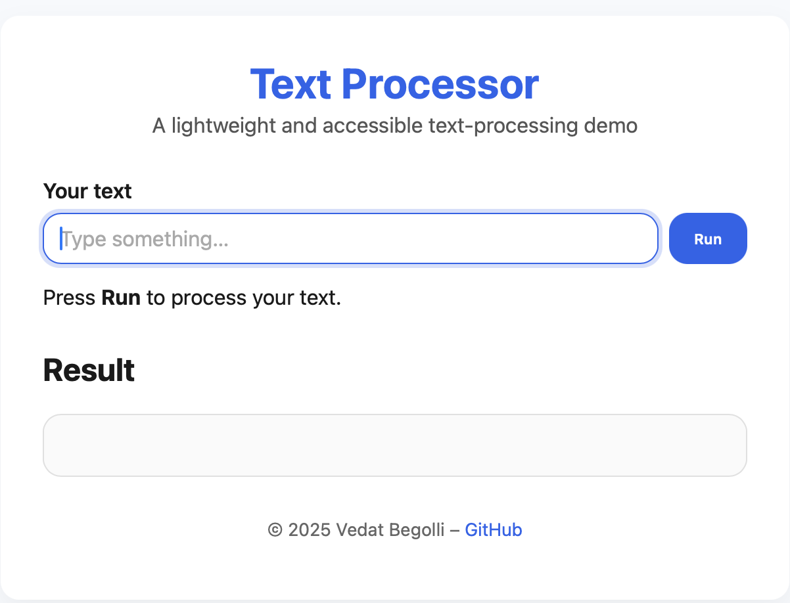
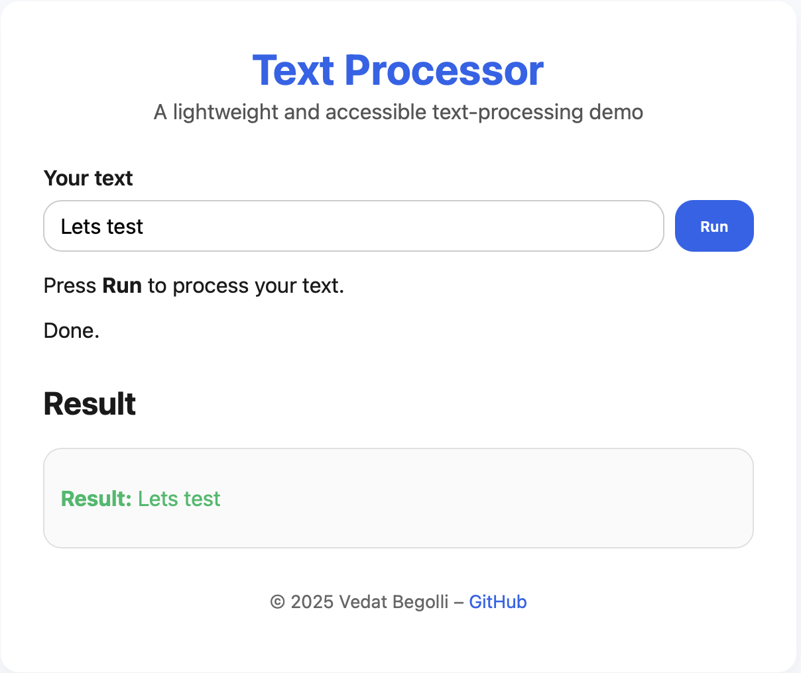
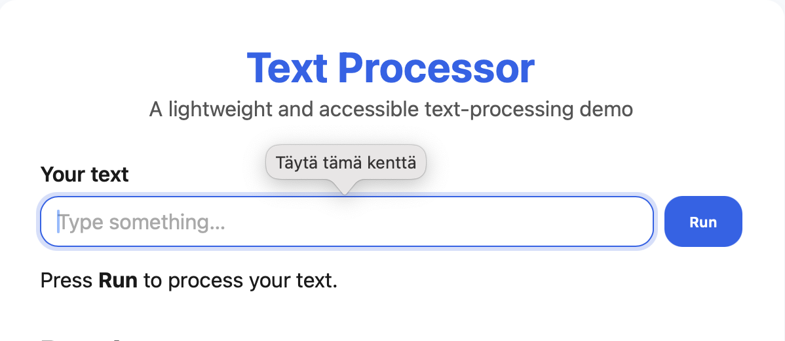

# Full Stack Project 1 – Demo App

**Live site:** [https://vbe1994.github.io/fullstack-project-1/](https://vbe1994.github.io/fullstack-project-1/)  
**Repository:** [https://github.com/vbe1994/fullstack-project-1](https://github.com/vbe1994/fullstack-project-1)

---

## ✨ Features
- Users can type text and see the result instantly.
- Error handling: empty input shows a validation message.
- Loading and done states are visible to the user.
- Fully responsive and accessible UI (keyboard-friendly).
- Safe text handling using `escapeHTML()` to prevent XSS.
- Simple and fast front-end structure using HTML, CSS, and JS.

---

## 📸 Screenshots

**Home view**  


**Result view**  


**Error validation**  



## ⚙️ Run Locally

### Windows
```bash
git clone https://github.com/vbe1994/fullstack-project-1.git
cd fullstack-project-1
start index.html

## macOS
bash
git clone https://github.com/vbe1994/fullstack-project-1.git
cd fullstack-project-1
open index.html
